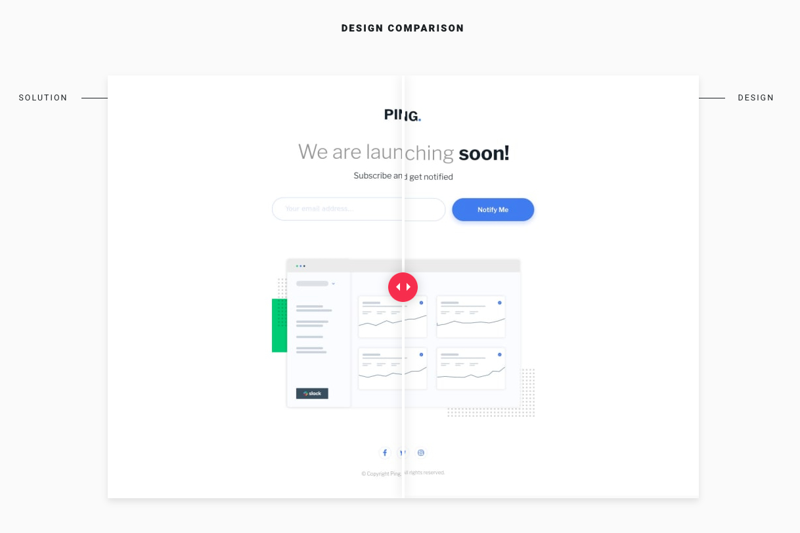

# [Frontend Mentor](frontendmentor.io/) - Ping single column coming soon page

## The challenge
The challenge is to build out this Coming Soon page and get it looking as close to the design as possible.

Users should be able to:

- View the optimal layout for the site depending on their device's screen size
- See hover states for all interactive elements on the page
- Submit their email address using an `input` field
- Receive an error message when the `form` is submitted if:
	- The `input` field is empty. The message for this error should say *"Whoops! It looks like you forgot to add your email"*
	- The email address is not formatted correctly (i.e. a correct email address should have this structure: `name@host.tld`). The message for this error should say *"Please provide a valid email address"*
## Link

- Live Site URL: [https://dinahbrito.github.io/ping-coming-soon/](https://dinahbrito.github.io/ping-coming-soon/)

## Built With

- JavaScript
- Semantic HTML5 markup
- Flexbox
- CSS Grid
- Mobile-first workflow

